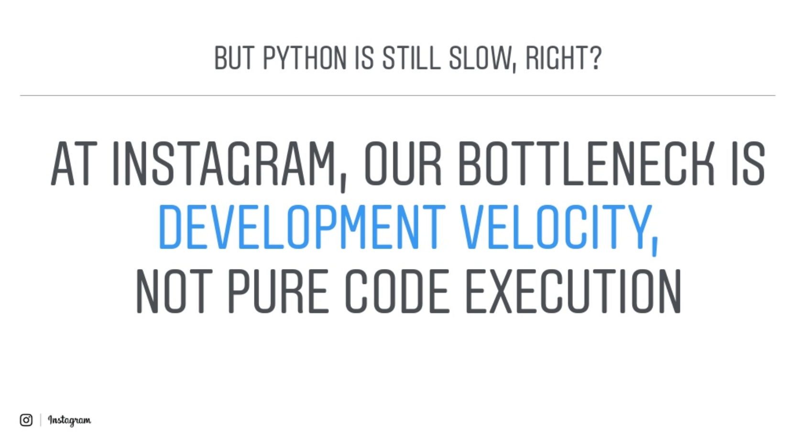
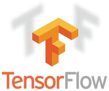

title: プログラミング言語 Python
date: 2020/05/05

[Python](https://www.python.org/) は1990年代初頭ごろから公開されているプログラミング言語で、わかりやすく、実用的な言語として、広く使われ続けています。Pythonはプログラムの「読みやすさ・わかりやすさ」をとても重視していて、Pythonを知らない人でも、理解しやすいようにデザインされています。

もちろん、読みやすさ一辺倒ではなく、実用的で、高い拡張性も備えています。読みやすさ・習得しやすさと、実用性のバランスが、Pythonの大きな魅力といえるでしょう。

Pythonは汎用的なプログラミング言語の利用度調査などでは、常に高い位置を占めています。システム管理やツール・アプリケーション開発・科学技術計算・Webシステムなどで広く利用されてきました。特に、2010年代ごろからの機械学習ブームでは、優れた科学技術計算ツールとして評価され、大きな人気を得ました。

2020年度からは、日本の国家資格である基本情報技術者試験で出題されるプログラミング言語に、Pythonも追加されました。従来から選択可能だったCやJavaなどの言語に加え、Pythonもソフトウェア産業を支える基礎技術として活用されていることがよくわかります。

## Pythonはどんな風に使われているのか？

Pythonは汎用的なプログラミング言語で、いろいろなアプリケーション開発や、システム管理ツールとして幅広く使われています。ある程度の規模の企業なら、まったくPytonを利用していない、という企業はあまりないでしょう。

Pythonは、さまざまなWebサービスの開発にも使われています。著名なサービスでは、たとえば [Instagram](https://www.instagram.com/) はPythonを使ってサービスを提供しています。

2017年、アメリカのPythonカンファレンスであるPyCon US 2017のキーノート・スピーチで、Instagram の Hui Ding氏とLisa Guo氏 が InstagramでのPythonの使い方を紹介しました。

<iframe src="//www.slideshare.net/slideshow/embed_code/key/CLh5Laii8e9rEu" width="595" height="485" frameborder="0" marginwidth="0" marginheight="0" scrolling="no" style="border:1px solid #CCC; border-width:1px; margin-bottom:5px; max-width: 100%;" allowfullscreen> </iframe> 
 <strong> <a href="//www.slideshare.net/LisaGuo4/pycon2017-instagram-keynote" title="Pycon2017 instagram keynote" target="_blank">Pycon2017 instagram keynote</a> </strong> from <strong><a href="https://www.slideshare.net/LisaGuo4" target="_blank">Lisa Guo</a></strong> 

Instagramでは数十億ものユーザへのサービスを、PythonのWebアプリケーションフレームワーク <a href="https://www.djangoproject.com/">Django</a> を使って提供しています。

本来、Pythonはいわゆるスクリプト言語で、実行性能よりも使いやすさを優先した構造になっています。C言語などと比べれば実行速度は劣りますし、メモリ使用量も多くなります。Instagramのように、非常に多くのユーザからのリクエストを処理するサービスでは、最適なプログラミング言語とは言えません。

それでも、Instagram は実行性能では劣るPythonを採用しています。その理由を、次のように述べています

    Instagramのボトルネックは

        開発速度

    です。実行速度だけではありません。

Instagram以外でも、Pythonを使ってサービスを提供している企業からは、よくこういった発言が聞かれます。処理がどんなに高速でも、必要な機能を迅速に開発し、適切なタイミングで提供できなければ、ユーザに支持されるサービスにはならないのです。

## 科学技術計算

Pythonはまた、科学技術計算のためのツールとしても広く使われています。PythonはFortranやC言語のような、高速な科学技術計算が得意な言語ではありません。

しかし、Pythonの柔軟なアーキテクチャにより、FortranやC言語で開発された高速な処理を、Pythonに組み込んで利用するように拡張できます。こういった拡張を用意することで、プログラミングが専門ではない研究者でも、学習が容易なPythonを使って科学技術計算を実行できるようになります。

Pythonで科学的研究をサポートするツールに、[Jupyter Notebook](https://jupyter.org/) があります。

Jupyter NotebookはWebアプリケーションで、文章や実行可能なプログラム、実行結果のグラフなどを、一つのドキュメントにまとめて管理できます。プログラムを対話的に修正・実行して結果を保存できるので、調査・研究に必要な試行錯誤に最適な環境となっています。

## データサイエンス

Pythonの科学技術計算環境は、データサイエンス分野でも広く活用されています。

なかでも機械学習関連では大きな注目を集めており、[GoogleのTensorFlow](https://www.tensorflow.org/) や [FacebookのPyTorch](https://pytorch.org/) など、主要なパッケージはPythonを利用したパッケージが中心となっています。現状、機械学習を学ぶには、Pythonの知識が必須と言えるでしょう。

